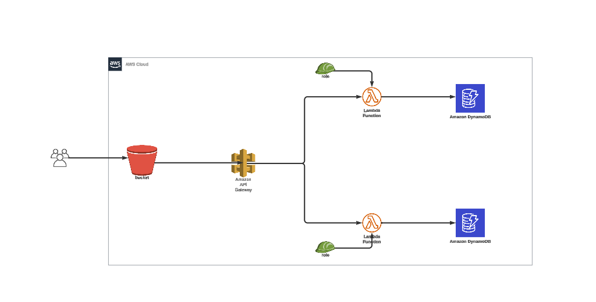

# Serverless-Application-Hosting-On-AWS
Description of a Multi-Tier Serverless Application for Food Ordering:

Our multi-tier serverless application is designed to streamline the process of food ordering, offering two core functionalities: menu listing and order management. Leveraging the power of AWS services such as S3 for hosting the front end, API Gateway, Lambda, DynamoDB, and IAM, our application ensures scalability, flexibility, and security.

**1. Frontend (S3):** The application's frontend is hosted on Amazon S3, providing a reliable and highly available platform for serving static web content. Users can access the application through a web browser, where they will be presented with an intuitive user interface to browse the menu and place orders.

**2. API Gateway:** Acting as the entry point to our serverless architecture, API Gateway facilitates communication between the frontend and backend components of our application. It handles HTTP requests from the client and routes them to the appropriate AWS Lambda functions.

**3. Lambda Functions:** AWS Lambda functions serve as the backend logic for our application, allowing us to execute code in response to various events triggered by API Gateway requests. We utilize Lambda functions to implement the business logic for menu listing and order management. These functions interact with DynamoDB to retrieve menu items, store orders, and update order statuses.

**4. DynamoDB:** DynamoDB serves as our NoSQL database for storing menu items, orders, and related data. It offers seamless scalability and low-latency performance, ensuring that our application can handle a high volume of concurrent requests. Menu items are stored as JSON objects, allowing for easy retrieval and manipulation.

**5. AWS IAM:** Identity and Access Management (IAM) is utilized to securely control access to AWS resources within our application. We define IAM roles and policies to grant appropriate permissions to Lambda functions, API Gateway, and other components, ensuring that only authorized users and services can interact with our application's resources.

**Functionality:**

- **Menu Listing:** Users can browse the menu items offered by the restaurant through the frontend interface. When a user requests the menu, an API Gateway endpoint triggers a Lambda function, which retrieves the menu data from DynamoDB and returns it to the client for display.

- **Order Management:** Once a user selects items from the menu and places an order, the order details are sent to the backend through API Gateway. A Lambda function processes the order, stores it in DynamoDB, and returns a confirmation to the client. Additionally, Lambda functions handle order status updates and notifications to keep users informed throughout the order fulfillment process.

Overall, our multi-tier serverless application provides a seamless and efficient experience for both customers and restaurant staff, leveraging AWS services to deliver scalability, reliability, and security.

